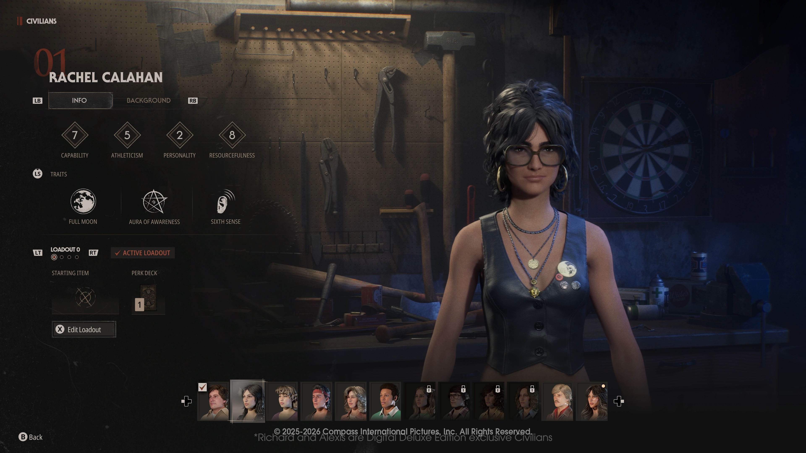
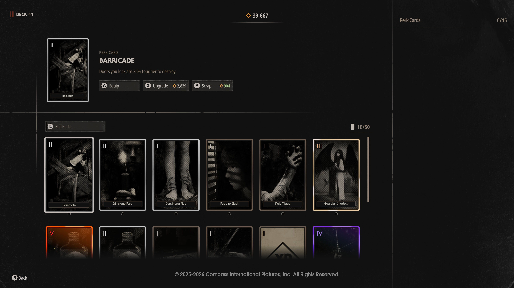
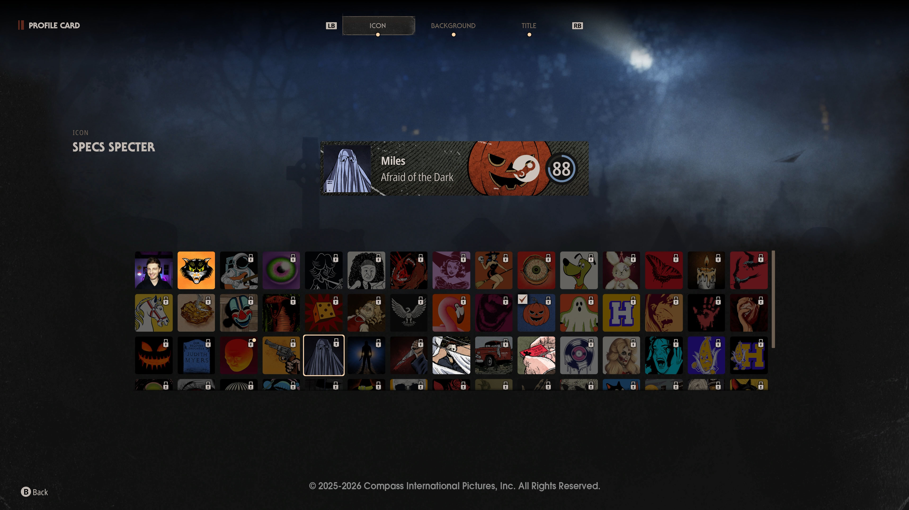

<!--
  This file is generated from site-spec.yaml.
  Do not edit directly.
  Run npm run site:generate instead.
  Source: site-input/pages/progression-perks.md
-->
# Halloween: The Game Progression & Perks — How Unlocks Work

Quick answer
- Progression is split into four independent XP tracks: Profile, Killer, Civilian, and Weapon.  
- XP is earned from singleplayer story chapters, private matches against AI, and online 1v4 matchmaking.  
- Civilian progression uses Perk Points to roll for Perk Cards; players build Perk Decks and can temporarily upgrade cards for a limited number of matches.  
- Michael loadouts start with two fixed traits (Killer Sense and Shape Jump) plus three selectable abilities (examples shown publicly include Reality Tear, Blackout, Detection Pulse — there are additional abilities). Progression unlocks new Michael abilities, unlockable starting weapons and tints, executions, cosmetics, and additional Civilians.  
- Players can prestige when a progression category reaches its max level. Exact unlock orders, the full published perk roster, and numeric perk values remain unpublished and require live-build verification.

How progression levels work
1. Four separate progression categories track XP independently:
   - Profile Level — XP regardless of role (applies to your overall account/profile).  
   - Killer Level — XP earned while playing as Michael.  
   - Civilian Level — XP tied to each playable Civilian character.  
   - Weapon Level — XP for kills made with specific equipable Michael weapons.
2. Where to earn XP (in player order):
   1. Play singleplayer story mode chapters.  
   2. Run private matches against AI.  
   3. Play online in 1v4 matchmaking.
3. What progression unlocks (high-level list): additional playable Civilians, new Michael abilities, supplemental starting items for Civilians, cosmetic rewards (skins and tints), new challenge tiers, executions, and other rewards called out by IllFonic.
4. Prestige: when you reach max level in any of the four categories you may prestige that category (players can prestige in Profile, Killer, Civilian, or Weapon categories).

Challenges overview
- Passive Challenges: tracked for Killer and Civilian categories regardless of which character is used.  
- Progressive Challenges: tied to specific Civilians, Michael skins, and weapon types; these are unlocked and completed in sequence.  
- Singleplayer Challenges: optional per story chapter; completing them unlocks alternate outfits and unique cosmetics. IllFonic also notes a legendary outfit reward for completing every singleplayer challenge.  
- IllFonic states the game contains “100s of challenges”; challenge progress feeds into progression and cosmetic unlocks.

Michael unlocks and loadout
  
*Official screenshot of character customization and loadout options unlocked through progression.*

- Starting traits: all Michael loadouts include two fixed starting traits — Killer Sense and Shape Jump.  
- Selectable abilities: each Michael loadout also includes three selectable abilities chosen by the player. Public examples include Reality Tear, Blackout, and Detection Pulse; the developer presents these as examples, not an exhaustive list.  
- Progression unlocks tied to Michael: new abilities, additional starting weapons (and earnable tints), executions, and Killer skins/tints.  
- Cosmetic and progression systems are accessed through the character/loadout UI shown above; exact ability lists, unlock order, and numerical ability values are not fully published.

Civilian perks, decks, and customization
  
*Official Progression & Customization screenshot of the Civilian Perk Cards UI and deck builder.*

- Civilian stats (names only): Athleticism, Personality, Resourcefulness, Capability. (No public numeric values are published.)  
- Perk Points and Perk Cards:
  1. Completing matches grants Perk Points.  
  2. Perk Points are spent to roll for Perk Cards; rolls are randomized so matches vary.  
  3. Spending more Perk Points increases the odds of rolling higher‑rarity cards.  
  4. Perk Points can temporarily upgrade owned cards for a limited number of matches.  
  5. Players place chosen Perk Cards into Perk Decks that are equipped to Civilian loadouts.
- Civilian customization also includes outfits (with tints), hair/headwear, eyewear, and makeup/blemishes, plus unlockable starting items. Perk Decks are the primary gameplay customization for Civilians and are built from rolled Perk Cards; the developer has not published a complete public list of every Perk Card or their numeric values.

Profile cards (brief)
  
*Official screenshot showing player customization options tied to progression rewards.*

- Profile progression unlocks Profile Icons, Backgrounds, and Titles.  
- These items are combined into Profile Cards used for online multiplayer presentation and flair. Profile rewards are earned via progression and some challenge completions.

What still needs live-build verification
- Exact unlock orders for specific abilities, Civilians, weapons, and cosmetics.  
- Full perk roster and every Perk Card’s exact effects and rarity distribution.  
- Numeric perk values, XP-per-level tables, prestige reward schedules, and other granular numbers — these have not been published as a complete encyclopedia by IllFonic.  
- Any developer changes to progression systems after the published overview (live-build adjustments); players should verify in-game where precise costs, quantities, or order matter.

Related guides
- [Michael Myers — Hub](/michael-myers/)  
- [Michael Abilities](/michael-myers/abilities/)  
- [Playable Characters — Hub](/characters/)  
- [Multiplayer: How It Works](/multiplayer/how-multiplayer-works/)  
- [Guide Hub](/)

Sources
- [Progression & Customization overview — Halloween: The Game](https://halloweengame.com/news/progression-customization-overview/)  
- [Halloween: The Game Launch and Early Access](https://halloweengame.com/news/halloween-the-game-launch-and-early-access/)
