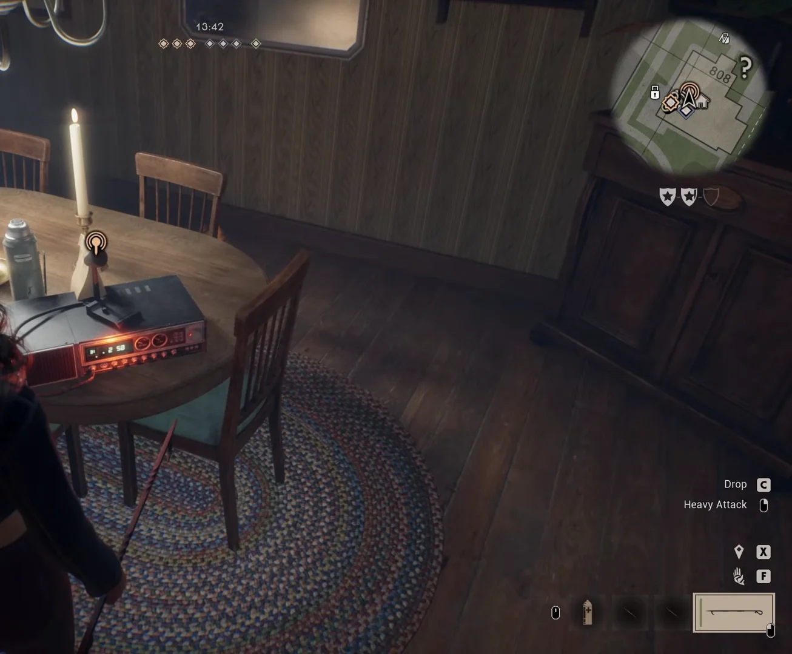
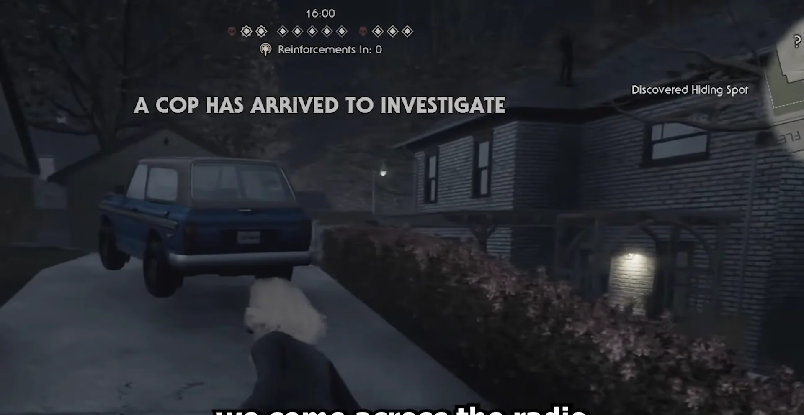
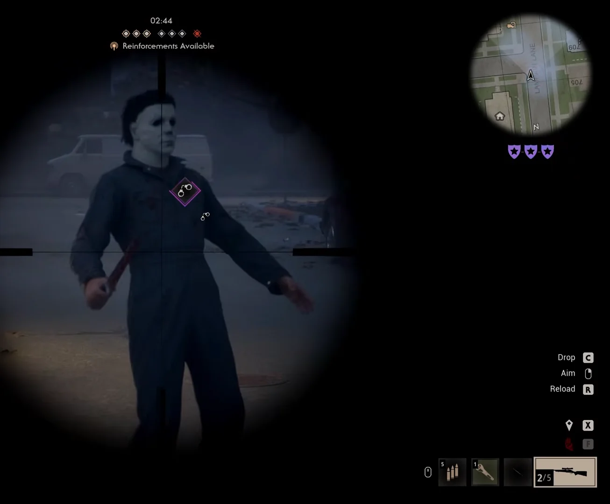
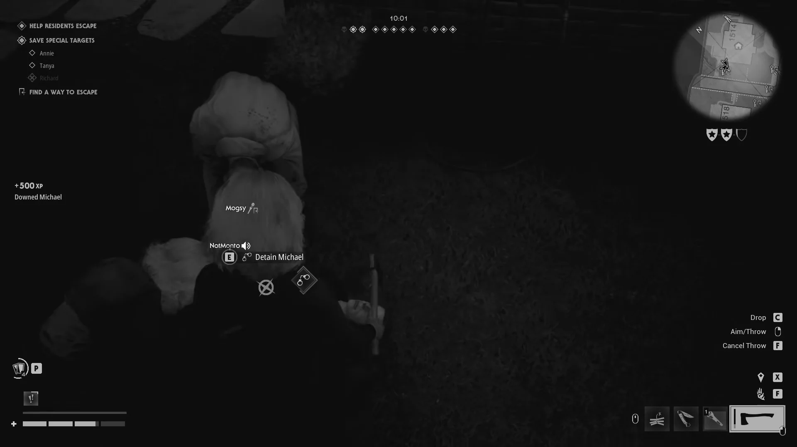
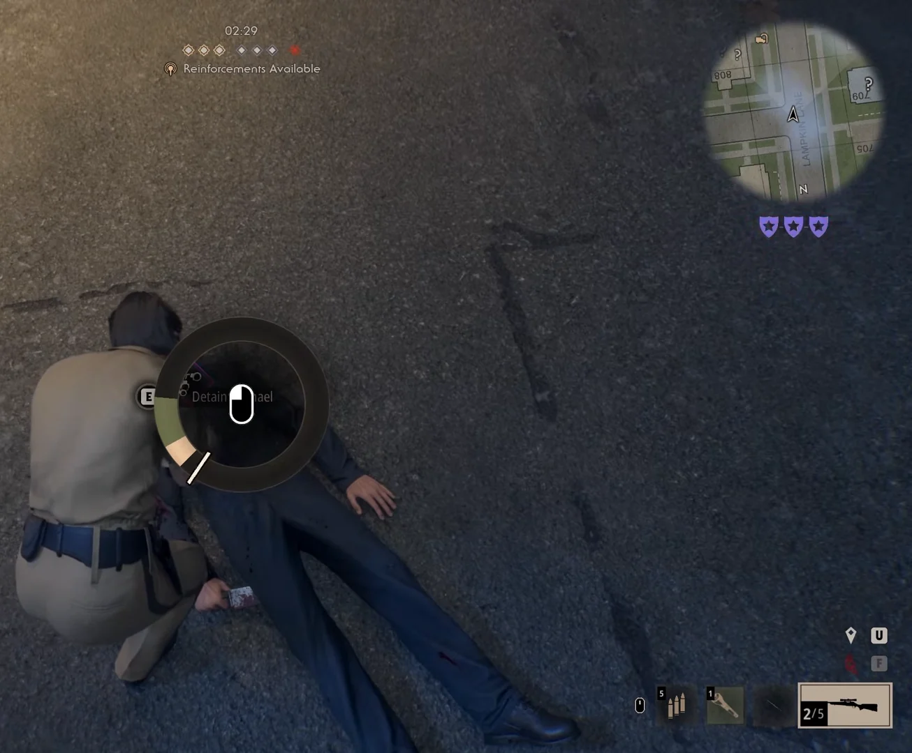
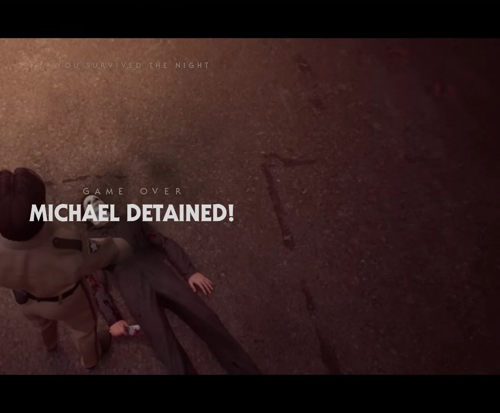

<!--
  This file is generated from site-spec.yaml.
  Do not edit directly.
  Run npm run site:generate instead.
  Source: site-input/pages/michael-myers/how-to-arrest.md
-->
# How to Arrest Michael Myers in Halloween: The Game — Detain Sequence

Quick Answer

You cannot kill Michael Myers in multiplayer. The team win is detainment: use normal police/reinforcement systems until Michael shows a visible handcuff readiness marker, keep him where authority characters can apply pressure, then knock him down while that marker is active. When the prompt appears, press [E] Detain Michael, finish the short circular detain minigame before he recovers, and the match ends with MICHAEL DETAINED! — Michael is returned to Smith's Grove Sanitarium. Spectators can call Dr. Loomis by CB radio, and Spectator Reinforcements can return a player as a police officer when that option appears.

## Can you kill Michael Myers?

No. Michael cannot be killed; detention is the launch-state alternative team win. Knockdowns alone are not a kill — you must complete the detain interaction while the arrest-readiness state is active.

See also the [Michael Myers hub](/michael-myers/) for the broader killer overview.

## How the arrest system works

- Use normal police-contact systems (Civilian calls and Reinforcements) to advance police presence; no single universal call count or exact officer requirement is verified.
- Spectators can call Dr. Loomis via a CB radio and Spectator Reinforcements can return a player as a police officer when that reinforcement option appears.
- Arrest readiness is visible: a handcuff-style indicator appears on or near Michael while pressure builds. Only a knockdown that occurs while that readiness marker is present opens the detain window.
- After the ready-state knockdown, the prompt [E] Detain Michael appears. Complete the short time-limited circular progress interaction before Michael recovers to secure the arrest.

## Who can perform the final arrest?

Footage shows a player using the on-screen **[E] Detain Michael** prompt to finish the interaction. It does not establish that the prompt is police-only or that every Civilian can always use it; exact role restrictions remain UNKNOWN.

## Step-by-step arrest sequence (8 steps)

1. **Build police / reinforcement pressure**
   Use Civilian tools to call police and keep authority characters (or potential authority respawns) in play. Spectator-side options can call Dr. Loomis by CB radio and may return a player as an officer via Spectator Reinforcements.

   
   *Shows the CB radio interaction and floating radio marker. Bryce Games @ 01:30.*

2. **Watch for authority escalation cues**
   Look for escalation banners such as police-arrival messages and Reinforcements indicators; these signal progression but do not provide exact numeric requirements.

   
   *Shows the `A COP HAS ARRIVED TO INVESTIGATE` HUD state. D3AD Plays @ 02:02; it is authority corroboration, not proof that detainment is ready.*

3. **Keep Michael where authority can apply pressure and wait for the handcuff readiness marker**
   When readiness is building, Michael shows a handcuff-style diamond/icon on or near him. Do not rely on a random knockdown before this marker.

   
   *Shows the purple handcuff-style readiness diamond on Michael. Bryce Games @ 02:18.*

4. **Prepare teammates to protect the detainer**
   Position players to block Michael and protect whoever will attempt the detain interaction once the knockdown opens the window.

5. **Knock Michael down while the handcuff indicator is visible**
   Only a knockdown that occurs during the ready state reliably opens the detain prompt; earlier stuns let him recover without the interaction.

6. **Move to Michael and press [E] Detain Michael when the prompt appears**
   The prompt itself is the permission check — wait for it to appear before attempting to detain.

   ![[E] Detain Michael prompt — Bryce Games @ 02:25](../../../assets/evidence/arrest-michael/bryce-detain-prompt.webp)
   *Shows the `[E] Detain Michael` prompt after the valid knockdown. Bryce Games @ 02:25.*

   
   *Shows the Detain prompt in an independent match. D3AD Plays @ 07:44.*

7. **Finish the short circular detain progress / minigame**
   Complete the time-limited circular progress interaction before Michael recovers. Protect the player doing the interaction so it does not abort.

   
   *Shows the active circular Detain Michael minigame. Bryce Games @ 02:28.*

8. **Confirm the success state (end match)**
   If the interaction completes in time, the match ends with MICHAEL DETAINED! — Michael is returned to Smith's Grove Sanitarium and remaining Civilians do not require a separate escape.

   
   *Shows the final **MICHAEL DETAINED!** end-state banner. Bryce Games @ 02:38.*

## Common failure reasons (and quick fixes)

- **No police / reinforcement HUD and no handcuff icon** → The arrest-readiness state has not appeared. Continue using police/reinforcement paths; exact officer counts and triggers are unverified.
- **Michael is downed but no handcuff indicator** → The knockdown occurred before readiness. Keep advancing police pressure and try again when the marker appears.
- **Handcuff indicator was visible but no [E] after knockdown** → The detain window was missed or the input was not taken; stay close and act immediately on the next valid knockdown.
- **[E] Detain starts but progress aborts** → The minigame was not finished before recovery or the detainer was interrupted; protect the detaining player and attempt again.

## Arrest meter / handcuff state: how to judge

- **Ready:** Handcuff-style diamond/icon visible on or near Michael, often alongside Reinforcements HUD text.
- **Not ready:** Michael can still be stunned or knocked down but no Detain prompt appears; this is the most common failure point.
- **Go:** After a ready-state knockdown, the on-screen prompt [E] Detain Michael appears — complete the circular progress to finish the arrest.

## What happens after Michael is detained

- The match ends with MICHAEL DETAINED! (GAME OVER / You Survived The Night).
- Remaining Civilians do not need a separate vehicle or Storm Cellar escape after detainment.
- Official materials describe detainment as returning Michael to Smith's Grove Sanitarium.

## Known limitations / launch-version notes

- Exact arrest-meter fill rates, required officer counts, cooldowns, and guaranteed reinforcement paths remain UNKNOWN.
- It is not confirmed whether NPC officers can finish Detain without a player pressing [E], or whether every Civilian role can always start the prompt.
- Loomis / CB-radio spawn locations and some HUD wording may vary by match or in later patches.

## Related guides

- [Multiplayer hub](/multiplayer/)
- [How multiplayer works](/multiplayer/how-multiplayer-works/)
- [Michael Myers hub](/michael-myers/)

## Sources / video attribution

- [Multiplayer gameplay overview — Halloween: The Game](https://halloweengame.com/news/multiplayer-gameplay-overview/) (official: Michael cannot be killed; Deputy / Loomis return; detain to Smith's Grove)
- [Bryce Games — How To Arrest Michael Myers In Halloween: The Game](https://www.youtube.com/watch?v=EN2Ik4aHgBE) — CB radio @ 01:30, Reinforcements @ 01:45, handcuff readiness @ 02:18, Detain prompt @ 02:25, minigame @ 02:28, MICHAEL DETAINED! @ 02:38
- [D3AD Plays — We ARRESTED Michael Myers in Halloween!](https://www.youtube.com/watch?v=fJsZDScSAYU) — police arrival HUD @ 02:02, Detain prompt @ 07:44
