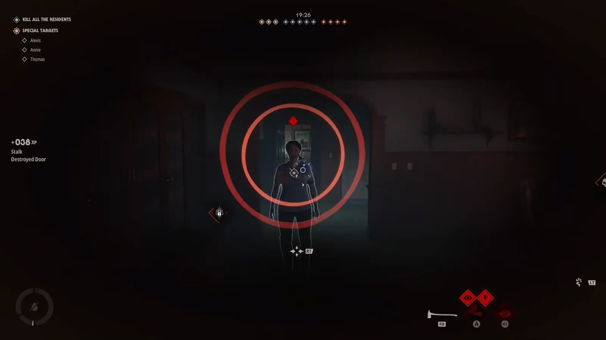

<!--
  This file is generated from site-spec.yaml.
  Do not edit directly.
  Run npm run site:generate instead.
  Source: site-input/pages/michael-myers/abilities.md
-->
Evil Presence is an unlockable Michael ability observed in Early Access. It creates a short-range aura around Michael that visibly staggers or interrupts nearby Civilians, giving him an opening to close distance or cut off an escape. Community reports add trip/fall and Stalk Tier 3 → execution stories, but those are not proven rules. Official materials do not publish Evil Presence’s exact unlock level, cooldown, range, duration, damage, or resource cost.

## What does Evil Presence do?

Evil Presence is an unlockable Michael ability seen in Early Access multiplayer. It occupies a **selectable Michael ability slot** — it is **not** one of Michael’s two official starting traits (Killer Sense + Shape Jump).

Observed EA gameplay shows Evil Presence as a **short-range area/aura** around Michael. Nearby Civilians can be **visibly staggered** or have their **movement interrupted**.

In the successful runs reviewed, that stagger/interruption created an opening for Michael to **close distance** or **interrupt an escape**.

*Evil Presence evidence — Middi @ 1:35.*  
**Frame shows:** concentric red rings / short-range aura locked onto a nearby Civilian in EA multiplayer.  
**Proves:** Evil Presence presents as a short-range area/aura that can affect a nearby Civilian.  
**Does not prove:** exact range, cooldown, duration, a guaranteed trip/fall, Stalk Tier 3 as a requirement, or a guaranteed execution.

### What to look for when it activates

- A short-range aura / ring effect near Michael or the targeted Civilian
- Nearby Civilians visibly staggering or losing clean movement
- A brief window where Michael can close in before they recover

### How is it useful during a chase?

In the successful runs reviewed, the aura’s stagger/interruption can break a Civilian’s movement enough for Michael to close distance, stop a retreat, or otherwise interrupt an escape attempt.

### Does Evil Presence require Stalk Tier 3?

**No hard requirement is confirmed.** Some players describe a **Tier 3 Stalk → chase → Evil Presence → execution** sequence. Treat that as a community-reported play order, not a rule that Evil Presence needs Stalk Tier 3.

### Does it guarantee an execution?

**No.** Official materials do not say Evil Presence guarantees an execution. Observed runs and community reports may show it used in sequences that end in an execution, but there is no proof that Evil Presence alone always finishes one.

### How do you unlock it / what is still unknown?

Official progression materials confirm Killer progression unlocks new Michael abilities, and Michael loadouts use **2 starting traits + 3 selectable abilities**. Evil Presence appears as one of those selectable abilities in EA footage.

Still **launch verification pending** (not published officially): exact Killer Level unlock; cooldown, range, and duration; damage, stagger probability, and blood/resource cost; formal Chase State requirement; whether stagger is a guaranteed trip/fall; whether Stalk Tier 3 is required; whether an execution chain is guaranteed; Bloodthirst interaction.

### Observed stagger vs reported trip

| What players see | Evidence status |
| --- | --- |
| Short-range aura with visible stagger / movement interruption | Observed in EA gameplay (Middi) |
| Civilians trip or fall | Community-reported only — not proven as a guaranteed trip mechanic |
| Tier 3 Stalk → Evil Presence → execution chain | Community-reported play order — not a hard requirement |

Secondary Xander noob footage shows short stun/stagger near Michael, but it cannot cleanly prove that effect is Evil Presence. Use Middi for the core Evil Presence claim.

## Loadout model (official)

- **2 starting traits:** Killer Sense + Shape Jump
- **3 selectable Michael abilities** chosen by the player
- Killer progression unlocks **new Michael abilities**, starting weapons, executions, and cosmetics

Official examples of selectable abilities include Reality Tear, Blackout, and Detection Pulse — examples only, not a complete roster. Evil Presence is documented here from EA gameplay, not as an official named list entry.

## Other Michael abilities (reference)

| Ability / trait | Confirmed role |
| --- | --- |
| **Killer Sense** | First-person awareness mode; helps Michael detect nearby prey |
| **Stalk** | Builds while focusing targets; improves tracking; unlocks stronger execution opportunities. Official mechanic — **not** one of the two starting traits |
| **Shape Jump** | Enter shadows and move unseen; enter/exit only in darkness or outside resident line of sight |
| **Shape Dash** | Forward burst / lunge available from Shape Jump |
| **Blackout / lights** | Shut off lights, cut power, trigger temporary blackouts; darkness enables Shape Jump |
| **Combat / resistance** | Melee options; Civilians can fight back and knock Michael down; he cannot simply be killed; enough resistance can [detain him](/how-to-arrest-michael-myers/) back to Smith’s Grove |

Exact combat numbers, detention triggers, Stalk meter values, and Shape Jump / Shape Dash cooldowns remain **launch verification pending**.

## Launch verification pending

- Evil Presence numeric values (level, cooldown, range, duration, damage, cost)
- Guaranteed trip / Stalk Tier 3 / execution-chain rules for Evil Presence
- Full execution move list and unlock conditions
- Best ability combos or Civilian counter-play guides

## Sources

- [Progression & customization overview — Halloween: The Game](https://halloweengame.com/news/progression-customization-overview/)
- [Multiplayer gameplay overview — Halloween: The Game](https://halloweengame.com/news/multiplayer-gameplay-overview/)
- Middi — *The BEST Ability On Myers In Halloween The Game (Evil Presence)* — [YouTube @ 1:35](https://www.youtube.com/watch?v=DUohGl2xF7c&t=95s)
- Xander noob — *MICHAEL MYERS' NEW ABILITY | Halloween: The Game* — secondary stagger context only: [YouTube](https://www.youtube.com/watch?v=z6SAsHMCJ_c)
