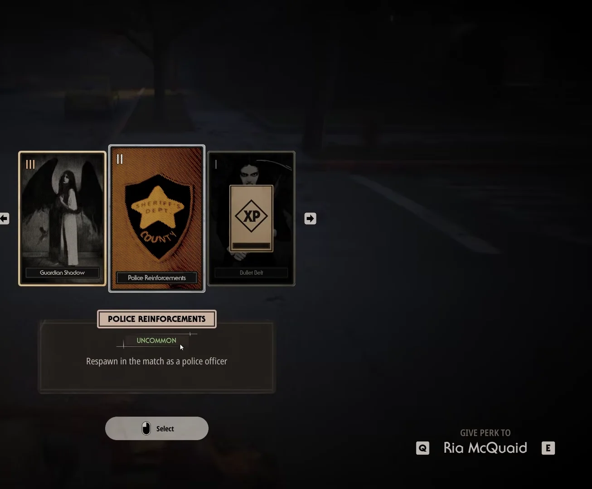
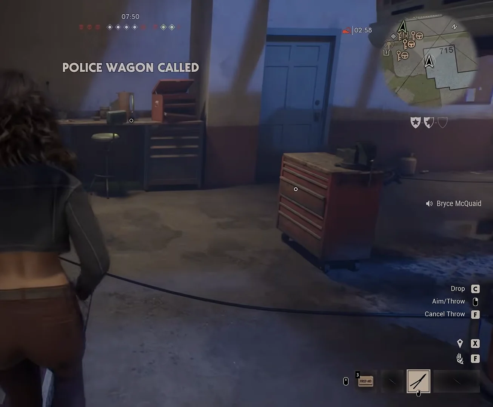

<!--
  This file is generated from site-spec.yaml.
  Do not edit directly.
  Run npm run site:generate instead.
  Source: site-input/pages/michael-myers/how-to-arrest.md
-->
# How to Arrest Michael Myers in Halloween: The Game

Quick Answer

You cannot simply kill Michael Myers in multiplayer. Instead the match escalates police and reinforcement pressure until a detainment window opens: Michael shows a handcuff-style indicator when arrest readiness is building; after that, knock him down, press **[E] Detain Michael**, finish the short circular progress interaction, and the match ends with **MICHAEL DETAINED!** — Michael is returned to Smith’s Grove Sanitarium and remaining Civilians do not need a separate escape.

## Can you kill Michael Myers?

No. Official IllFonic materials state **YOU CAN’T KILL THE BOOGEYMAN**. With enough community resistance, the proper equipment, and manpower, Michael can be **detained** and shipped back to **Smith’s Grove Sanitarium**. Steam store copy also describes Heroes facing an **unkillable** enemy. Knockdowns alone are not a kill.

See also the [Michael Myers hub](/michael-myers/) for the broader killer overview.

## How the arrest system works

- Police and reinforcements escalate through Civilian calls and reinforcement progression. Observed HUD includes **POLICE WAGON CALLED**, **A COP HAS ARRIVED TO INVESTIGATE**, and **Reinforcements Available** / **Reinforcements In**.
- Dead or escaped Civilians can still support the match and return as a **Sheriff’s Deputy** or **Dr. Loomis** (official overview). Spectator-side **Police Reinforcements** can respawn a player as a police officer.
- Arrest readiness shows as a **handcuff-style indicator** (diamond/icon with handcuffs) on or near Michael while pressure builds.
- Only after readiness is established does a knockdown open the usable detain window. Earlier knockdowns let him recover.
- In the ready state, **[E] Detain Michael** appears. Finish the short circular progress interaction before he recovers. Success ends the match with **MICHAEL DETAINED!**

## Step-by-step arrest sequence

1. **Build police / reinforcement pressure**  
   Call police through Civilian tools and keep authority figures in play. Dead or escaped players can still help via Loomis/deputy return or the Police Reinforcements perk (“Respawn in the match as a police officer”).

  
*Look for the floating radio/antenna marker over the table CB set — authority-support path. Bryce Games @ 1:30.*

  
*Look at the selected card text: **Police Reinforcements** → “Respawn in the match as a police officer.” Bryce Games @ 1:45.*

2. **Confirm police progression on the HUD**  
   Watch for escalation such as **POLICE WAGON CALLED**, **A COP HAS ARRIVED TO INVESTIGATE**, and **Reinforcements Available** / **Reinforcements In**.

  
*Look top-center for **POLICE WAGON CALLED** and the top-right police-vehicle countdown. H2O Delirious collab (@ Bryce McQuaid) @ 11:33.*

  
*Look for the centered banner **A COP HAS ARRIVED TO INVESTIGATE**. D3AD Plays @ 2:02.*

3. **Wait for the handcuff readiness marker before the decisive knockdown**  
   When readiness is building, Michael shows a handcuff-style indicator. Knocking him down without that marker is why many teams “can’t arrest” him.

  
*Look on Michael’s chest for the purple handcuff diamond while **Reinforcements Available** is up. Bryce Games @ 2:18.*

4. **Knock Michael down while the handcuff indicator is active**  
   The useful knockdown is the one that opens the detain interaction, not every earlier stun.

5. **Press [E] Detain Michael**  
   After a valid ready-state knockdown, the prompt **[E] Detain Michael** appears with a handcuff icon.

![Annotated [E] Detain Michael prompt after knockdown](../../../../assets/evidence/arrest-michael/bryce-detain-prompt-annotated.webp)  
*Look at the center prompt **[E] Detain Michael** + handcuff icon (yellow callout). Bryce Games @ 2:25.*

![Independent [E] Detain Michael prompt](../../../../assets/evidence/arrest-michael/d3ad-detain-prompt.webp)  
*Same prompt from a second session after **Downed Michael** XP (grayscale is an in-match filter). D3AD Plays @ 7:44.*

6. **Finish the short circular progress interaction**  
   Complete the circular progress / input before Michael recovers.

  
*Look for the circular **Detain Michael** progress ring while he stays down. Bryce Games @ 2:28.*

7. **Confirm MICHAEL DETAINED!**  
   Success ends the match. Remaining Civilians do not need a separate car or Storm Cellar escape afterward.

  
*Look for the end-state banner **MICHAEL DETAINED!** (GAME OVER / You Survived The Night). Bryce Games @ 2:38.*

## Why can't I arrest Michael?

| Current state | Meaning | Next step |
| --- | --- | --- |
| No police/reinforcement HUD; no handcuff icon | Arrest pressure has not built | Call police / keep reinforcements coming; get a Deputy or Loomis into the fight |
| Michael is downed but no handcuff indicator | Knockdown happened before readiness | Hold pressure near police until the handcuff marker appears, then knock him down again |
| Handcuff indicator visible, but no [E] after knockdown | Detain window missed or input not taken | Stay close; knock him down again while the marker is active and press **[E]** immediately |
| **[E] Detain** starts but progress aborts | Minigame not finished before recovery | Protect the detaining player and complete the circular progress in full |
| Team dumps damage away from officers | Pressure is not building the arrest state | Stop chasing Michael into empty yards; keep him near active police / returned officers |

## Arrest meter / handcuff state how to judge

- **Ready:** Handcuff-style diamond/icon on or near Michael, usually alongside reinforcement HUD such as **Reinforcements Available**.
- **Not ready:** Michael can still be stunned or downed, but he recovers and no **Detain** prompt appears — this is the most common “why can’t I arrest him?” failure.
- **Go:** After a ready-state knockdown, **[E] Detain Michael** appears. That prompt — not the knockdown alone — is the interaction that finishes the arrest.

## What happens after Michael is detained

- The match ends with **MICHAEL DETAINED!** (GAME OVER / You Survived The Night).
- Remaining Civilians do not need a separate escape afterward.
- Official materials describe successful detainment as shipping Michael back to **Smith’s Grove Sanitarium**.

## Known limitations / launch-version notes

- Exact arrest-meter fill rates, cooldowns, and required officer counts remain unverified.
- It is not confirmed whether NPC officers can finish Detain without a player pressing **[E]**.
- Loomis / CB-radio spawn locations vary match to match; exact spawn rules are unverified.
- Footage is Early Access / launch-window multiplayer; HUD wording may change in later patches.

## Related guides

- [Michael Myers hub](/michael-myers/)
- [How multiplayer works](/multiplayer/how-multiplayer-works/)
- [Maps hub](/maps/)

## Sources / video attribution

- [Multiplayer gameplay overview — Halloween: The Game](https://halloweengame.com/news/multiplayer-gameplay-overview/) (official: cannot kill Michael; Deputy / Loomis return; detain to Smith’s Grove)
- [Halloween: The Game on Steam](https://store.steampowered.com/app/3219630/Halloween_The_Game/) (Heroes face an unkillable enemy)
- [Bryce Games — How To Arrest Michael Myers In Halloween: The Game](https://www.youtube.com/watch?v=EN2Ik4aHgBE) — key timestamps: radio @ 1:30, Police Reinforcements @ 1:45, handcuff indicator @ 2:18, Detain prompt @ 2:25, minigame @ 2:28, MICHAEL DETAINED! @ 2:38
- [D3AD Plays — We ARRESTED Michael Myers in Halloween! ft. Monto, Mogsy](https://www.youtube.com/watch?v=fJsZDScSAYU) — key timestamps: police arrival HUD @ 2:02, Detain prompt @ 7:44
- [We Arrested Michael Myers In Halloween: The Game (ft. H2O Delirious)](https://www.youtube.com/watch?v=Qny8MsFE670) — POLICE WAGON CALLED @ 11:33
- [ArrisWuju — ARRESTING Myers Details](https://www.youtube.com/watch?v=3c2KBoCE4qo) (supporting commentary on Loomis/cop requirement, bar fill, knockdown prerequisite)
