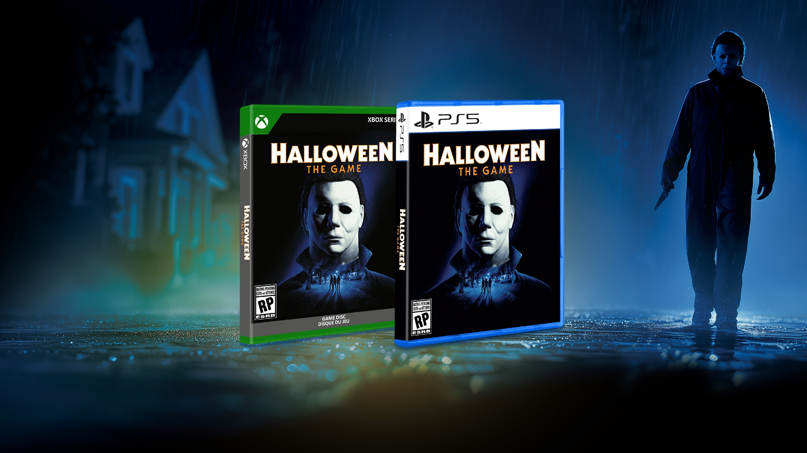

<!--
  This file is generated from site-spec.yaml.
  Do not edit directly.
  Run npm run site:generate instead.
  Source: site-input/pages/michael-myers/skins.md
-->
# Halloween: The Game Michael Myers Skins — Phantom, Inmate, Clown & Samhain

Quick answer
- Confirmed Michael Myers skins: Base, Phantom, Inmate, Clown, Samhain.
- Phantom is a Digital pre-order exclusive. If you skip the digital pre-order, Phantom is unavailable for purchase after launch and can be missed permanently.
- Inmate is included with the Digital Deluxe edition; the Deluxe Upgrade at launch includes Inmate.
- Clown and Samhain are Advance Access cosmetics tied to physical editions at launch (Clown on Physical Standard / Collector’s packaging; Samhain on the Collector’s packaging) but both are also earnable later via in‑game challenges — they are not permanent physical exclusives.
- For progression and where skins appear in customization, see the [Progression & Customization overview](/progression-perks/).

Known Michael skins — quick comparison

| Skin | How you get it (confirmed) | Launch availability note | Risk of permanent miss |
|---|---:|---|---|
| Base Michael | Default with Michael ownership | Available through normal play | No |
| Phantom | Digital pre-order exclusive | Only given to digital pre-orders; not granted by physical editions | Yes — unavailable for purchase after launch if missed |
| Inmate | Digital Deluxe / Deluxe Upgrade at launch | Included with Deluxe and Deluxe Upgrade | No (not listed as preorder-exclusive) |
| Clown | Physical edition Advance Access; also earnable via challenges | Bundled as Advance Access with physical editions at launch; can be earned later | No |
| Samhain | Collector’s Edition Advance Access; also earnable via challenges | Bundled as Collector’s Advance Access at launch; can be earned later | No |

  
*Official physical editions artwork showing packaging context for Advance Access cosmetics (used to illustrate physical edition cosmetic bundles).*

Phantom
1. What it is: Phantom is a Digital pre-order exclusive Michael skin confirmed by the publisher.
2. How it was distributed: Phantom was granted to players who pre-ordered the digital edition.
3. Important availability detail: Phantom is unavailable for purchase after launch. If you did not get the digital pre-order that included Phantom, the publisher’s notes indicate Phantom cannot be bought later — making it a permanent miss for those accounts that did not pre-order digitally.
4. Physical editions: Physical pre-orders or physical edition ownership do not grant Phantom.

Inmate
1. What it is: Inmate is a Michael skin packaged with the Digital Deluxe edition.
2. Deluxe Upgrade: The Deluxe Upgrade available at launch includes Inmate (confirmed).
3. Notes: Inmate is tied to Deluxe/deluxe-upgrade ownership; it is not described as a pre-order-only exclusive the way Phantom is.

  
*Official customization overview art — Michael skins live inside the broader Killer customization and progression UI.*

Clown
1. Launch access: Clown appears as an Advance Access cosmetic included with physical editions (Physical Standard and Collector’s packaging).
2. Later availability: Clown is also earnable later by completing in‑game challenges — so players who didn’t get the physical edition can still obtain it later.
3. Exclusivity note: Clown is not a permanent physical exclusive.

  
*Physical Standard product art listing Clown Michael as Advance Access with the disc edition packaging.*

Samhain
1. Launch access: Samhain is an Advance Access cosmetic tied to the Collector’s Edition packaging at launch.
2. Later availability: Samhain is also earnable later via in‑game challenges.
3. Exclusivity note: Samhain is not a permanent physical exclusive.

  
*Official Collector’s Edition product art — Clown and Samhain Michael Advance Access appear with the physical package.*

Which skins can be missed permanently?
- Phantom is the only confirmed skin listed as a permanent miss if you skip the digital pre-order: it was a Digital pre-order exclusive and is unavailable for purchase after launch.
- Inmate, Clown, and Samhain are not described as permanent preorder-only exclusives in the publisher notes: Inmate is included with Deluxe/Deluxe Upgrade; Clown and Samhain are Advance Access via physical editions but both are earnable later via challenges.

Which are early unlocks rather than exclusives?
- Clown and Samhain: Advance Access through physical editions at launch — effectively early unlocks for physical buyers because the same cosmetics can be earned later in-game via challenges.
- Inmate: Included with Digital Deluxe / Deluxe Upgrade at launch; not labelled as a preorder-exclusive.
- Phantom: Not an early unlock — confirmed as a true digital pre-order exclusive and unavailable for purchase after launch.

Progression / customization connection
- Michael skins are part of the broader Killer customization system and progression. For how XP, Prestige, and customization tie together and where skin unlocks appear in the UI, see the [Progression & Customization overview](/progression-perks/).
- Edition context: For details on what the Digital Deluxe includes (Inmate) and how Deluxe Upgrade works, see [Standard vs Deluxe](/standard-vs-deluxe-upgrade/).
- Physical packaging and Advance Access context: see [Physical & Collector’s Edition](/physical-collectors-edition/) for what was bundled on the physical boxes at launch.

Unknown skins / tints boundary
- This page covers only the confirmed Michael skins: Base, Phantom, Inmate, Clown, Samhain. Do not infer additional named skins, tints, or variants from UI silhouettes or unconfirmed menus.
- The publisher notes supplied here do not list a larger launch roster or tint catalogs; any other skin names or color variants remain unconfirmed and are excluded from this page.

FAQ
Q: Can I buy Phantom later if I missed the digital pre-order?
A: No — Phantom is confirmed as a Digital pre-order exclusive and is unavailable for purchase after launch if you did not pre-order digitally.

Q: Does buying a physical edition give me Phantom?
A: No — physical pre-orders or physical editions do not grant Phantom. Phantom was limited to digital pre-orders.

Q: Are Clown and Samhain permanent physical exclusives?
A: No — both were Advance Access cosmetics tied to physical packaging at launch, but both are also earnable later through in‑game challenges.

Q: Is Inmate only for day-one Deluxe buyers?
A: Inmate is included with the Digital Deluxe edition, and the Deluxe Upgrade at launch includes Inmate. The publisher materials confirm Inmate is part of Deluxe packaging at launch.

Sources
- [Physical Editions — Halloween: The Game](https://halloweengame.com/news/physical-editions/)  
- [Pre-order Halloween: The Game](https://halloweengame.com/news/preorder/)  
- [Unleash Hell Upon Haddonfield — Halloween: The Game](https://halloweengame.com/news/unleash-hell-upon-haddonfield/)  
- [Progression & Customization overview — Halloween: The Game](https://halloweengame.com/news/progression-customization-overview/)  
- [Standard vs Deluxe / edition context page on this site](/standard-vs-deluxe-upgrade/)  
- [Physical & Collector’s Edition packaging context on this site](/physical-collectors-edition/)  
- [Michael Myers hub](/michael-myers/)  
- [Halloween Game hub](/)
