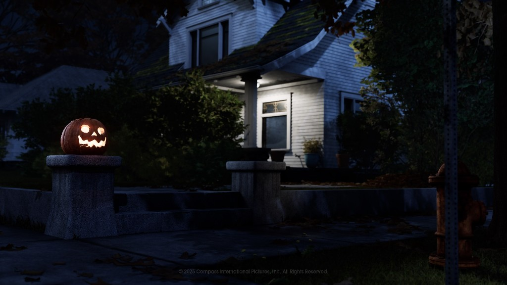
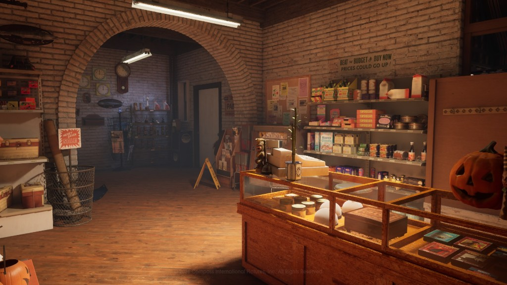
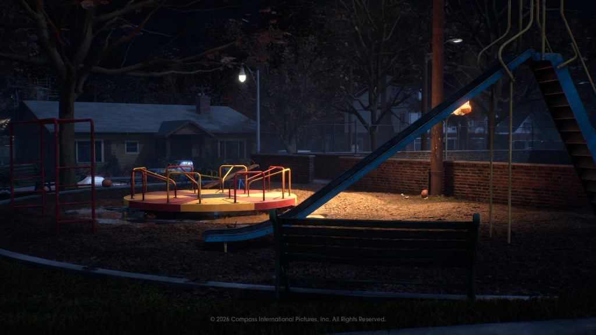
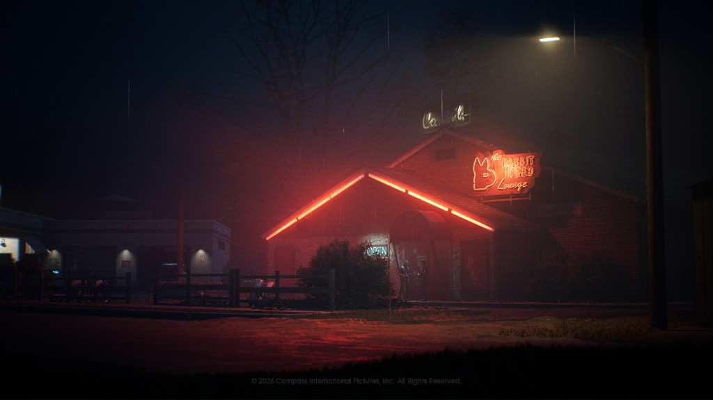

<!--
  This file is generated from site-spec.yaml.
  Do not edit directly.
  Run npm run site:generate instead.
  Source: site-input/pages/maps.md
-->
# Halloween: The Game Maps: All 4 Launch Locations

Quick Answer

Halloween: The Game launches with 4 multiplayer maps: Haddonfield Heights, Haddonfield Town Center, Orange Grove Estates, and East Haddonfield.  
This page compares the confirmed landmarks and settings for each launch map; exact item spawns, fixed escape routes, and final map meta are not published and require launch verification.

All 4 launch maps at a glance

| Map | Setting | Key confirmed landmarks | Dedicated guide |
| --- | --- | --- | --- |
| [Haddonfield Heights](/maps/haddonfield-heights/) | Residential neighborhood | Myers house; Lampkin Lane; water tower; Strode house (neighborhood landmark) | [Haddonfield Heights guide](/maps/haddonfield-heights/) |
| [Haddonfield Town Center](/maps/haddonfield-town-center/) | Downtown / commercial district | Nichols Hardware; A-Side Music Store; Hill Garden Center; Patty's Pub | [Town Center guide](/maps/haddonfield-town-center/) |
| [Orange Grove Estates](/maps/orange-grove-estates/) | Upscale residential / multi-level homes | Doyle residence; Wallace residence; playground / neighborhood park | [Orange Grove Estates guide](/maps/orange-grove-estates/) |
| [East Haddonfield](/maps/east-haddonfield/) | Rural / agricultural / industrial outskirts | Rabbit in Red Lounge; Phelps Garage; Midwest Feed Company; farmland / silos | [East Haddonfield guide](/maps/east-haddonfield/) |

Haddonfield Heights

  
*Official Haddonfield Heights map view — residential neighborhood setting*

Key confirmed facts
- Setting: modest residential neighborhood with fenced yards and dim streets.
- Confirmed landmarks: the Myers house, Lampkin Lane, and a local water tower; the Strode house is also shown as a neighborhood landmark.  
- For detailed layout and gameplay notes, see the full [Haddonfield Heights guide](/maps/haddonfield-heights/).

Haddonfield Town Center

  
*Official Town Center landmark — Nichols Hardware*

Key confirmed facts
- Setting: downtown commercial district with multiple named storefronts.
- Confirmed landmarks: Nichols Hardware, A-Side Music Store, Hill Garden Center, and Patty's Pub.  
- See the [Town Center guide](/maps/haddonfield-town-center/) for landmark-level notes and official media.

Orange Grove Estates

  
*Official Orange Grove Estates park / playground landmark*

Key confirmed facts
- Setting: upscale suburban neighborhood with larger, multi-level homes.
- Confirmed landmarks: Doyle and Wallace residences, neighborhood playground/park and associated open sightlines.  
- Visit the [Orange Grove Estates guide](/maps/orange-grove-estates/) for the developer flythrough and landmark detail.

East Haddonfield

  
*Official East Haddonfield landmark — The Rabbit in Red Lounge*

Key confirmed facts
- Setting: rural / agricultural / industrial outskirts (farmland, silos, and related facilities).
- Confirmed landmarks: Rabbit in Red Lounge, Phelps Garage, Midwest Feed Company (plus surrounding rural structures).  
- East Haddonfield is also confirmed to appear in at least one single-player chapter; do not infer the other three maps correspond 1:1 to story chapters. See the [East Haddonfield guide](/maps/east-haddonfield/) for official screenshots and notes.

How the four maps differ

- Haddonfield Heights — dense residential blocks, smaller yards and streets; strong neighborhood theme centered on the Myers house and local landmarks.  
- Haddonfield Town Center — tighter commercial streets and interior storefronts; named businesses create distinct indoor play areas.  
- Orange Grove Estates — larger multi-level homes and open suburban blocks with parks/playgrounds and more verticality.  
- East Haddonfield — rural and industrial outskirts offering farmland, outbuildings, and standalone landmarks (different visual and tactical feel from the town maps).  

These differences are descriptive of setting and confirmed landmarks; exact gameplay implications (spawn points, optimal routes, or meta) require hands-on verification.

What is confirmed vs still unknown

Confirmed
- Halloween: The Game launches with 4 unique multiplayer maps: Haddonfield Heights, Haddonfield Town Center, Orange Grove Estates, and East Haddonfield.
- Each map’s core setting and the named landmarks listed above are shown in official developer materials.
- East Haddonfield is confirmed to appear in at least one single-player chapter (but this does not imply the other maps map 1:1 to chapters).
- Official developer pages and map flythroughs for each map are published (links in Sources).

Still unknown / launch verification pending
- Exact item spawn locations, fixed escape routes, and final map meta are not published; these require hands-on verification after Advance Access and full release.
- Post-launch map roadmap is not confirmed (no official DLC map counts or release dates have been announced).

Gameplay format note
- Official multiplayer materials are available; see the multiplayer overview for format and mode details: [Multiplayer overview](/multiplayer/how-multiplayer-works/).

FAQ

How many maps are in Halloween: The Game?  
Four launch multiplayer maps: Haddonfield Heights, Haddonfield Town Center, Orange Grove Estates, and East Haddonfield.

What are all four Halloween: The Game maps?  
Haddonfield Heights; Haddonfield Town Center; Orange Grove Estates; East Haddonfield.

Which map has the Myers house?  
Haddonfield Heights contains the Myers house and nearby neighborhood landmarks.

Which map has the Doyle and Wallace houses?  
Orange Grove Estates includes the Doyle and Wallace residences.

Which map has Nichols Hardware?  
Nichols Hardware is a confirmed landmark on Haddonfield Town Center.

Which map has Rabbit in Red Lounge?  
The Rabbit in Red Lounge is a confirmed landmark on East Haddonfield.

Will there be more maps after launch?  
A post-launch map roadmap has not been confirmed. No official DLC map counts or release dates have been announced.

Sources

- [The Locations of Halloween: The Game](https://halloweengame.com/news/the-locations-of-halloween-the-game/)  
- [Halloween: The Game Launch and Early Access](https://halloweengame.com/news/halloween-the-game-launch-and-early-access/)  
- [Haddonfield Heights map flythrough — Halloween: The Game](https://halloweengame.com/news/haddonfield-heights-map-flythrough/)  
- [Haddonfield Town Center — Halloween: The Game](https://halloweengame.com/news/haddonfield-town-center/)  
- [Orange Grove Estates — Halloween: The Game](https://halloweengame.com/news/orange-grove-estates/)  
- [PAX East 2026 — Halloween: The Game](https://halloweengame.com/news/pax-east-2026/)  
- [Multiplayer gameplay overview — Halloween: The Game](https://halloweengame.com/news/multiplayer-gameplay-overview/)
