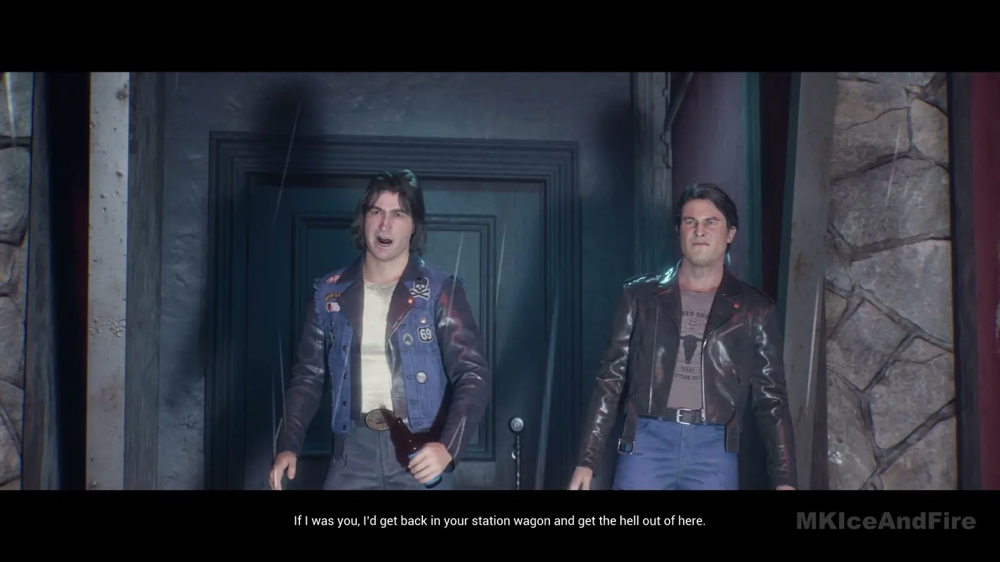
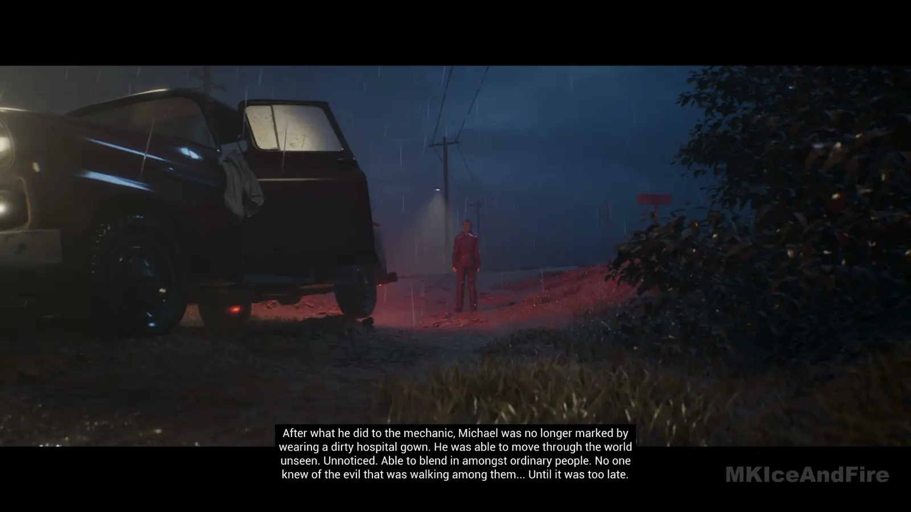
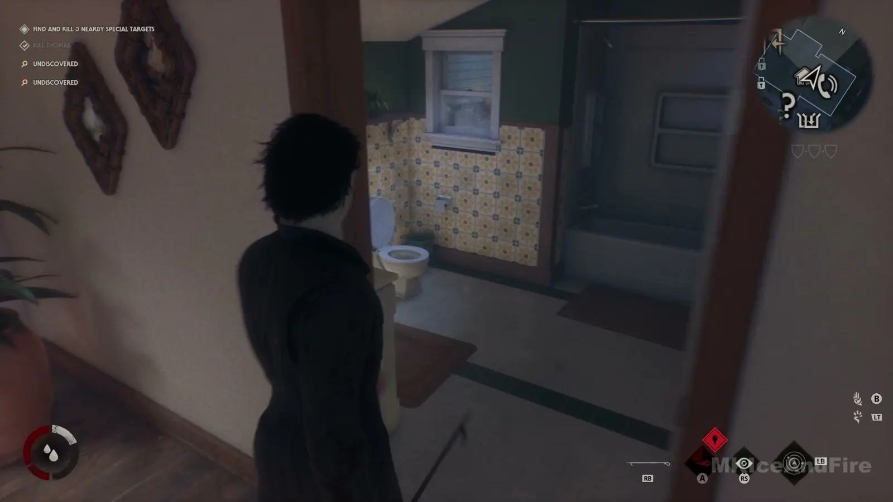
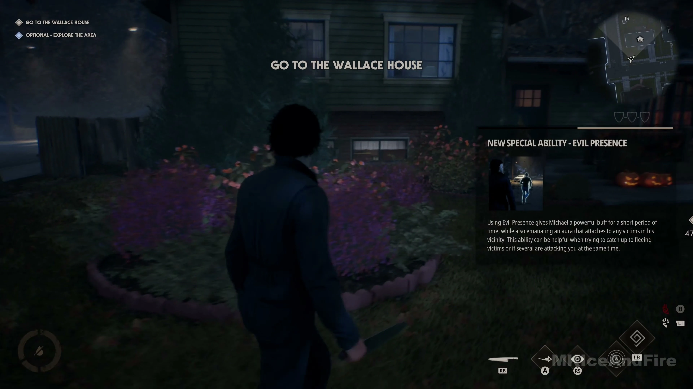
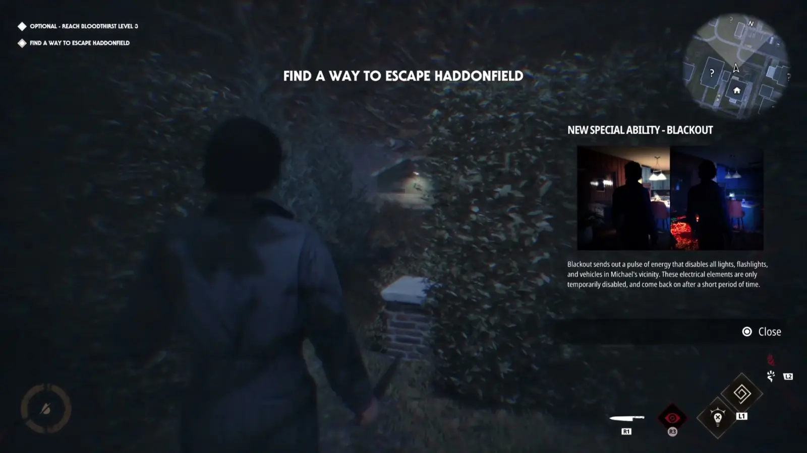
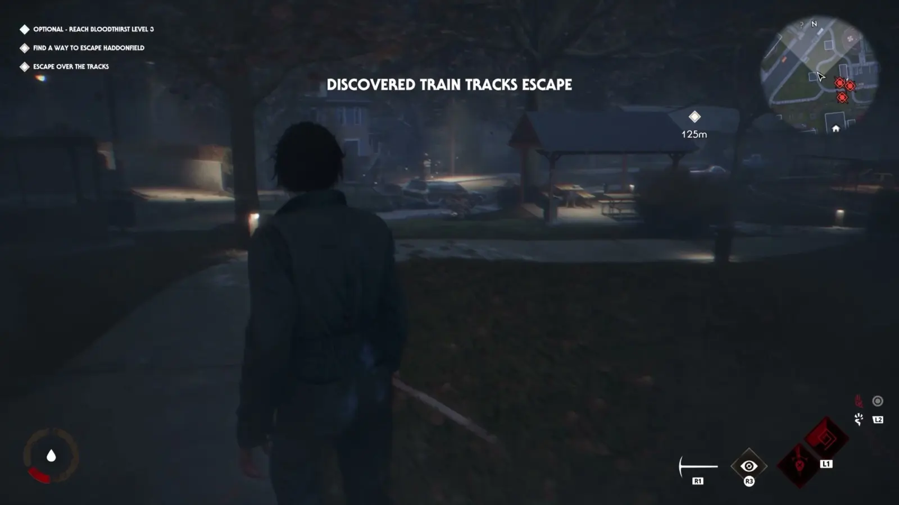

<!--
  This file is generated from site-spec.yaml.
  Do not edit directly.
  Run npm run site:generate instead.
  Source: site-input/pages/single-player.md
-->
# Halloween: The Game Single Player — Story Mode & Chapters

Quick answer

Story Mode is a single-player narrative containing 6 total chapters: a Prologue plus five numbered chapters (Chapters 1–5). In the successful runs reviewed, the campaign proceeds with the Prologue first and then Chapters 1–5 in that named order. The chapter progressions below are observed sequences from those runs, not guaranteed requirements. Optional challenges and collectibles are replay content tied to the six playable chapters. Current Early Access community reports describe possible save/reset, challenge/log registration, relock/loop, and Chapter 4 AI/timing problems; those reports are not confirmed as universal and do not establish a guaranteed workaround.

First-clear state map (observed)

- Prologue → Chapter 1 → Chapter 2 → Chapter 3 → Chapter 4 → Chapter 5.

## Prologue — observed route

In the successful runs reviewed:

1. Clear the initial orderly encounters.
2. Follow the power/gate progression cue.
3. Continue toward the station wagon.

*Prologue station-wagon route state.*

## Chapter 1 — observed progression

1. Encounter the Rabbit in Red sequence.
2. Follow the red/noise tracking segments.
3. Continue toward the mechanic progression state.

*Chapter 1 mechanic progression state.*

## Chapter 2 — observed progression

1. Advance through the hardware-store and mask-related progression.
2. Continue through named-target objectives.
3. Follow the Judith Myers tombstone sequence.
4. Return toward the car as the route moves toward closure.

## Chapter 3 — observed progression

1. Enter the Myers House sequence.
2. Complete the house/flashback material.
3. Continue to later neighborhood objectives.

*Myers House sequence in Chapter 3.*

## Chapter 4 — observed progression

1. Follow the Wallace House event chain.
2. Continue through the observed Bob/Lynda states.
3. Follow the later event-chain progression toward the Laurie phase.

*Wallace House objective in Chapter 4.*

## Chapter 5 — observed progression

1. Continue through the police/search-pressure phase.
2. Follow the escape objective when it appears.
3. In VIDEO-02, the observed run reaches a train-track escape branch. This is run-specific evidence, not a universal ending requirement.

*Chapter 5 escape objective.*

*Chapter 5 train-track escape branch.*

## First clear vs challenge cleanup

The chapter route above is for first-clear progression. Optional challenges and collectibles are replay content tied to the six chapters. Return to the relevant chapter for cleanup instead of letting an optional challenge derail the first clear.

## Stuck or bug? Early Access note

Community reports describe possible save/reset, challenge or Loomis Log registration, relock/loop, and Chapter 4 AI/timing problems. These reports are version-scoped Early Access observations, are not confirmed as universal, and have no guaranteed workaround. A missed optional timing window is different from a possible tracking or save issue: first check the current objective and state, then replay the chapter or consult current support/community updates if progress did not register.

## Replay, endings, and next step

After a first clear, replay individual chapters for optional challenges and collectibles. Chapter 5 ending routes remain partially unresolved in the current evidence; the train-track branch is directly observed in VIDEO-02 only.

## Sources and verified date

- [Unleash Hell Upon Haddonfield — Halloween: The Game](https://halloweengame.com/news/unleash-hell-upon-haddonfield/)
- [Halloween the Game single-player review — VGC](https://www.videogameschronicle.com/review/halloween-the-game-single-player-review-is-there-enough-here-for-solo-players/) (reviewed 2026-09-04)
- Gameplay cross-checks: MKIceAndFire, [VIDEO-01](https://www.youtube.com/watch?v=SR3vu4G0t1Q); Main Wave Gaming, [VIDEO-02](https://www.youtube.com/watch?v=d9Rk9PvL6Aw). Reviewed 2026-09-06.
